DE Seq Analysis of GSE119202
================
Kieran Bissessar
12/5/2019

# 1 Read in Data

read in
files

``` r
GSM3360685_C57  =  read.table("GSM3360685_C57-1.txt", header = T, sep="\t")
GSM3360686_C57  =  read.table("GSM3360686_C57-2.txt", header = T, sep="\t")
GSM3360687_C57  =  read.table("GSM3360687_C57-3.txt", header = T, sep="\t")
GSM3360688_KO   =  read.table("GSM3360688_KO-1.txt", header = T, sep="\t")
GSM3360689_KO   =  read.table("GSM3360689_KO-2.txt", header = T, sep="\t")
GSM3360690_KO   =  read.table("GSM3360690_KO-3.txt", header = T, sep="\t")
GSM3360691_Balb =  read.table("GSM3360691_Balb-1.txt", header = T, sep="\t")
GSM3360692_Balb =  read.table("GSM3360692_Balb-2.txt", header = T, sep="\t")
GSM3360693_Balb =  read.table("GSM3360693_Balb-3.txt", header = T, sep="\t")
```

GSM3360685\_C57 was duplicated for some reason

``` r
GSM3360685_C57=GSM3360685_C57[1:49585,]
```

Then a data frame was contructed using the unique gene
counts

``` r
GSE119202.RAW = data.frame("GSM3360685_C57"  =  as.numeric(GSM3360685_C57$Unique.gene.reads),
                           "GSM3360686_C57"  =  as.numeric(GSM3360686_C57$Unique.gene.reads),
                           "GSM3360687_C57"  =  as.numeric(GSM3360687_C57$Unique.gene.reads),
                           "GSM3360688_KO"   =  as.numeric(GSM3360688_KO$Unique.gene.reads),
                           "GSM3360689_KO"   =  as.numeric(GSM3360689_KO$Unique.gene.reads),
                           "GSM3360690_KO"   =  as.numeric(GSM3360690_KO$Unique.gene.reads),
                           "GSM3360691_Balb" =  as.numeric(GSM3360691_Balb$Unique.gene.reads),
                           "GSM3360692_Balb" =  as.numeric(GSM3360692_Balb$Unique.gene.reads),
                           "GSM3360693_Balb" =  as.numeric(GSM3360693_Balb$Unique.gene.reads),
                           row.names = GSM3360685_C57$Gene.ID)

head(GSE119202.RAW)
```

    ##                    GSM3360685_C57 GSM3360686_C57 GSM3360687_C57 GSM3360688_KO
    ## ENSMUSG00000102693              1              0              0             0
    ## ENSMUSG00000064842              1              0              0             0
    ## ENSMUSG00000051951            560             12              4             7
    ## ENSMUSG00000102851              1              0              0             0
    ## ENSMUSG00000103377              1              0              0             0
    ## ENSMUSG00000104017              1              0              0             0
    ##                    GSM3360689_KO GSM3360690_KO GSM3360691_Balb GSM3360692_Balb
    ## ENSMUSG00000102693             0             0               0               0
    ## ENSMUSG00000064842             0             0               0               0
    ## ENSMUSG00000051951             7             3              15              10
    ## ENSMUSG00000102851             0             0               0               0
    ## ENSMUSG00000103377             0             0               0               0
    ## ENSMUSG00000104017             0             0               0               0
    ##                    GSM3360693_Balb
    ## ENSMUSG00000102693               0
    ## ENSMUSG00000064842               0
    ## ENSMUSG00000051951               7
    ## ENSMUSG00000102851               0
    ## ENSMUSG00000103377               0
    ## ENSMUSG00000104017               0

# 2 Prepare for the Creation of our DESeq Dataset

There are three conditions: 1. C57(control) 2. KO 3. Balb

With these conditions, factors will be set and a column dataframe can be
constructed.

``` r
condition = as.factor(c(rep("C57",3),rep("KO",3),rep("Balb",3)))
column_data = data.frame(condition, row.names = colnames(GSE119202.RAW))
print(column_data)
```

    ##                 condition
    ## GSM3360685_C57        C57
    ## GSM3360686_C57        C57
    ## GSM3360687_C57        C57
    ## GSM3360688_KO          KO
    ## GSM3360689_KO          KO
    ## GSM3360690_KO          KO
    ## GSM3360691_Balb      Balb
    ## GSM3360692_Balb      Balb
    ## GSM3360693_Balb      Balb

# 3 Create DESeq Dataset

Now we can begin creating a DESeq Dataset.

``` r
library(DESeq2)
```

    ## Loading required package: S4Vectors

    ## Loading required package: stats4

    ## Loading required package: BiocGenerics

    ## Loading required package: parallel

    ## 
    ## Attaching package: 'BiocGenerics'

    ## The following objects are masked from 'package:parallel':
    ## 
    ##     clusterApply, clusterApplyLB, clusterCall, clusterEvalQ,
    ##     clusterExport, clusterMap, parApply, parCapply, parLapply,
    ##     parLapplyLB, parRapply, parSapply, parSapplyLB

    ## The following objects are masked from 'package:stats':
    ## 
    ##     IQR, mad, sd, var, xtabs

    ## The following objects are masked from 'package:base':
    ## 
    ##     anyDuplicated, append, as.data.frame, basename, cbind, colnames,
    ##     dirname, do.call, duplicated, eval, evalq, Filter, Find, get, grep,
    ##     grepl, intersect, is.unsorted, lapply, Map, mapply, match, mget,
    ##     order, paste, pmax, pmax.int, pmin, pmin.int, Position, rank,
    ##     rbind, Reduce, rownames, sapply, setdiff, sort, table, tapply,
    ##     union, unique, unsplit, which, which.max, which.min

    ## 
    ## Attaching package: 'S4Vectors'

    ## The following object is masked from 'package:base':
    ## 
    ##     expand.grid

    ## Loading required package: IRanges

    ## 
    ## Attaching package: 'IRanges'

    ## The following object is masked from 'package:grDevices':
    ## 
    ##     windows

    ## Loading required package: GenomicRanges

    ## Loading required package: GenomeInfoDb

    ## Loading required package: SummarizedExperiment

    ## Loading required package: Biobase

    ## Welcome to Bioconductor
    ## 
    ##     Vignettes contain introductory material; view with
    ##     'browseVignettes()'. To cite Bioconductor, see
    ##     'citation("Biobase")', and for packages 'citation("pkgname")'.

    ## Loading required package: DelayedArray

    ## Loading required package: matrixStats

    ## 
    ## Attaching package: 'matrixStats'

    ## The following objects are masked from 'package:Biobase':
    ## 
    ##     anyMissing, rowMedians

    ## Loading required package: BiocParallel

    ## 
    ## Attaching package: 'DelayedArray'

    ## The following objects are masked from 'package:matrixStats':
    ## 
    ##     colMaxs, colMins, colRanges, rowMaxs, rowMins, rowRanges

    ## The following objects are masked from 'package:base':
    ## 
    ##     aperm, apply, rowsum

``` r
cds = DESeqDataSetFromMatrix(countData = GSE119202.RAW,
                             colData = column_data,
                             design = ~ condition )
```

    ## converting counts to integer mode

``` r
print(cds)
```

    ## class: DESeqDataSet 
    ## dim: 49585 9 
    ## metadata(1): version
    ## assays(1): counts
    ## rownames(49585): ENSMUSG00000102693 ENSMUSG00000064842 ...
    ##   ENSMUSG00000064371 ENSMUSG00000064372
    ## rowData names(0):
    ## colnames(9): GSM3360685_C57 GSM3360686_C57 ... GSM3360692_Balb
    ##   GSM3360693_Balb
    ## colData names(1): condition

# 4 Analyze DeSeq Dataset object

It is useful to filter out low count genes in order to minimize bias.

``` r
keep = rowSums(counts(cds)) >= 10 # keep is a temp
cds = cds[keep,]
print(cds)
```

    ## class: DESeqDataSet 
    ## dim: 18782 9 
    ## metadata(1): version
    ## assays(1): counts
    ## rownames(18782): ENSMUSG00000051951 ENSMUSG00000089699 ...
    ##   ENSMUSG00000064368 ENSMUSG00000064370
    ## rowData names(0):
    ## colnames(9): GSM3360685_C57 GSM3360686_C57 ... GSM3360692_Balb
    ##   GSM3360693_Balb
    ## colData names(1): condition

30803 genes were filtered out (about 62%).

Now that we filtered by readcount, we can use the DESeq wrapper
function. This function estimates size factors (scaling factors used in
DESeq2 normalization), dispersions for each gene, and conducts a Wald
Test of DGE using the normalized count
    data.

``` r
cds = DESeq(cds)
```

    ## estimating size factors

    ## estimating dispersions

    ## gene-wise dispersion estimates

    ## mean-dispersion relationship

    ## -- note: fitType='parametric', but the dispersion trend was not well captured by the
    ##    function: y = a/x + b, and a local regression fit was automatically substituted.
    ##    specify fitType='local' or 'mean' to avoid this message next time.

    ## final dispersion estimates

    ## fitting model and testing

To oberve our dispersion estimates,

``` r
plotDispEsts(object = cds,
             main = "Gene Estimate Dispersion Plot",
             genecol = "black",
             fitcol = "brown",
             finalcol = "gray",
             legend = TRUE)
```

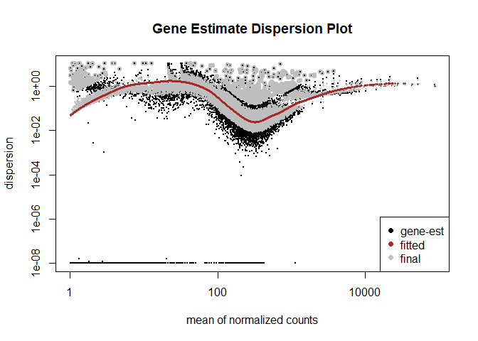

The fit type was chosen to be `local` and this is not the most ideal
plot.

A common first task to analyzing DGE data is to cluster samples
hierarchically and use Principal Components Analysis (PCA). This can
help provide an early indication of the distances between sample gene
expression profiles and detect possible batch effects.

Developers of DESeq2 recommend that before clustering of samples a
“regularized log” or “variance stabilizing” transformation should be
performed on the normalized counts. These transformations are for
clustering/machine learning applications only and are not used in the
statistical analysis of DGE.

Hierarchical Sample
    Clustering

``` r
rld = rlog(cds)
```

    ## -- note: fitType='parametric', but the dispersion trend was not well captured by the
    ##    function: y = a/x + b, and a local regression fit was automatically substituted.
    ##    specify fitType='local' or 'mean' to avoid this message next time.

``` r
dists = dist(t(assay(rld)))
plot(hclust(dists)) # one of the control seems off
```

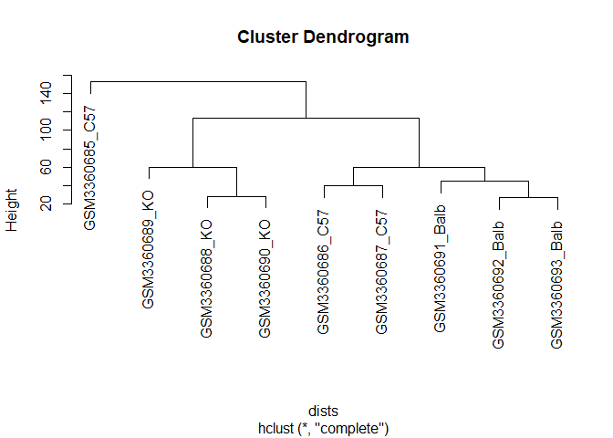

PCA

``` r
plotPCA(object = rld) # also shows one of the control being off
```

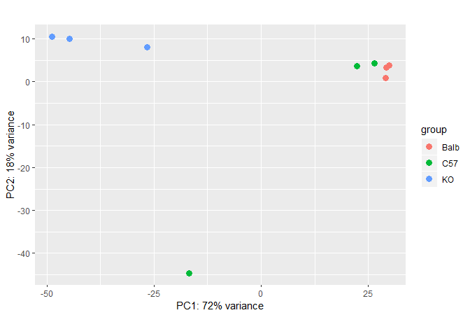

``` r
#batch effect? were they run on the same lane?
```

GSM3360685\_C57 is a bit off. Batch effect? This was also the sample
that was three times longer the rest and shortened.

Since its whack lets remove it

## Rectifying DESeq Dataset

``` r
#set wonky control sample to null
GSE119202.RAW$GSM3360685_C57 = NULL
head(GSE119202.RAW)
```

    ##                    GSM3360686_C57 GSM3360687_C57 GSM3360688_KO GSM3360689_KO
    ## ENSMUSG00000102693              0              0             0             0
    ## ENSMUSG00000064842              0              0             0             0
    ## ENSMUSG00000051951             12              4             7             7
    ## ENSMUSG00000102851              0              0             0             0
    ## ENSMUSG00000103377              0              0             0             0
    ## ENSMUSG00000104017              0              0             0             0
    ##                    GSM3360690_KO GSM3360691_Balb GSM3360692_Balb
    ## ENSMUSG00000102693             0               0               0
    ## ENSMUSG00000064842             0               0               0
    ## ENSMUSG00000051951             3              15              10
    ## ENSMUSG00000102851             0               0               0
    ## ENSMUSG00000103377             0               0               0
    ## ENSMUSG00000104017             0               0               0
    ##                    GSM3360693_Balb
    ## ENSMUSG00000102693               0
    ## ENSMUSG00000064842               0
    ## ENSMUSG00000051951               7
    ## ENSMUSG00000102851               0
    ## ENSMUSG00000103377               0
    ## ENSMUSG00000104017               0

``` r
condition = as.factor(c(rep("C57",2),rep("KO",3),rep("Balb",3)))
column_data = data.frame(condition, row.names = colnames(GSE119202.RAW))
print(column_data)
```

    ##                 condition
    ## GSM3360686_C57        C57
    ## GSM3360687_C57        C57
    ## GSM3360688_KO          KO
    ## GSM3360689_KO          KO
    ## GSM3360690_KO          KO
    ## GSM3360691_Balb      Balb
    ## GSM3360692_Balb      Balb
    ## GSM3360693_Balb      Balb

``` r
cds = DESeqDataSetFromMatrix(countData = GSE119202.RAW,
                             colData = column_data,
                             design = ~ condition )
```

    ## converting counts to integer mode

``` r
print(cds)
```

    ## class: DESeqDataSet 
    ## dim: 49585 8 
    ## metadata(1): version
    ## assays(1): counts
    ## rownames(49585): ENSMUSG00000102693 ENSMUSG00000064842 ...
    ##   ENSMUSG00000064371 ENSMUSG00000064372
    ## rowData names(0):
    ## colnames(8): GSM3360686_C57 GSM3360687_C57 ... GSM3360692_Balb
    ##   GSM3360693_Balb
    ## colData names(1): condition

``` r
#filter out low count genes to minimize bias
keep = rowSums(counts(cds)) >= 10 # keep is a temp
cds = cds[keep,]
print(cds)
```

    ## class: DESeqDataSet 
    ## dim: 18059 8 
    ## metadata(1): version
    ## assays(1): counts
    ## rownames(18059): ENSMUSG00000051951 ENSMUSG00000025900 ...
    ##   ENSMUSG00000064368 ENSMUSG00000064370
    ## rowData names(0):
    ## colnames(8): GSM3360686_C57 GSM3360687_C57 ... GSM3360692_Balb
    ##   GSM3360693_Balb
    ## colData names(1): condition

``` r
colnames(cds)
```

    ## [1] "GSM3360686_C57"  "GSM3360687_C57"  "GSM3360688_KO"   "GSM3360689_KO"  
    ## [5] "GSM3360690_KO"   "GSM3360691_Balb" "GSM3360692_Balb" "GSM3360693_Balb"

``` r
#DESeq wrapper function to normalize etc.
cds = DESeq(cds)
```

    ## estimating size factors

    ## estimating dispersions

    ## gene-wise dispersion estimates

    ## mean-dispersion relationship

    ## final dispersion estimates

    ## fitting model and testing

``` r
# see how our dispersions look

plotDispEsts(object = cds,
             main = "Gene Estimate Dispersion Plot - Rectified",
             genecol = "black",
             fitcol = "red",
             legend = TRUE)

rect(par("usr")[1], par("usr")[3], par("usr")[2], par("usr")[4], col = 
"grey")
```


Our Rectified Gene Estimate Dispersion Plot looks much better\!

# 5 Creating a DESeq Results Object for each Comparison

Next DESeq results objects were created. Using the contrast parameter,
the control (C57) was compared with the knockout variant, the control
(C57) was compared with the Balb variant, and the KO variant was
compared with the Balb variant.

``` r
expgenes_C57_KO_res = results(cds, contrast = c("condition","C57","KO"))
head(expgenes_C57_KO_res)
```

    ## log2 fold change (MLE): condition C57 vs KO 
    ## Wald test p-value: condition C57 vs KO 
    ## DataFrame with 6 rows and 6 columns
    ##                            baseMean       log2FoldChange             lfcSE
    ##                           <numeric>            <numeric>         <numeric>
    ## ENSMUSG00000051951 7.82769296757493   0.0302789203498367 0.805051510630414
    ## ENSMUSG00000025900 8.54049907856344     1.63125816921934 0.798955407826139
    ## ENSMUSG00000025902 47.0523335301977     1.67920287911263 0.386790605460432
    ## ENSMUSG00000033845 246.983751821523    0.462706852858853 0.243023833824468
    ## ENSMUSG00000025903 46.8805396331648 -0.00402141293835492 0.387513373711025
    ## ENSMUSG00000104217 8.53485179313381   -0.209452881706504 0.795616398757415
    ##                                   stat               pvalue                padj
    ##                              <numeric>            <numeric>           <numeric>
    ## ENSMUSG00000051951  0.0376111589755618    0.969997710642357   0.987233433146663
    ## ENSMUSG00000025900    2.04173869184739   0.0411774585614544   0.122690720313561
    ## ENSMUSG00000025902    4.34137451997761 1.41594133685522e-05 0.00017469654602011
    ## ENSMUSG00000033845     1.9039566843187   0.0569158257200646   0.155703962902691
    ## ENSMUSG00000025903 -0.0103774816849386    0.991720116196888   0.997124299063645
    ## ENSMUSG00000104217  -0.263258628195227    0.792351245153257   0.891373624154569

``` r
mcols(expgenes_C57_KO_res)$description
```

    ## [1] "mean of normalized counts for all samples"  
    ## [2] "log2 fold change (MLE): condition C57 vs KO"
    ## [3] "standard error: condition C57 vs KO"        
    ## [4] "Wald statistic: condition C57 vs KO"        
    ## [5] "Wald test p-value: condition C57 vs KO"     
    ## [6] "BH adjusted p-values"

``` r
expgenes_C57_Balb_res = results(cds, contrast = c("condition","C57","Balb"))
head(expgenes_C57_KO_res)
```

    ## log2 fold change (MLE): condition C57 vs KO 
    ## Wald test p-value: condition C57 vs KO 
    ## DataFrame with 6 rows and 6 columns
    ##                            baseMean       log2FoldChange             lfcSE
    ##                           <numeric>            <numeric>         <numeric>
    ## ENSMUSG00000051951 7.82769296757493   0.0302789203498367 0.805051510630414
    ## ENSMUSG00000025900 8.54049907856344     1.63125816921934 0.798955407826139
    ## ENSMUSG00000025902 47.0523335301977     1.67920287911263 0.386790605460432
    ## ENSMUSG00000033845 246.983751821523    0.462706852858853 0.243023833824468
    ## ENSMUSG00000025903 46.8805396331648 -0.00402141293835492 0.387513373711025
    ## ENSMUSG00000104217 8.53485179313381   -0.209452881706504 0.795616398757415
    ##                                   stat               pvalue                padj
    ##                              <numeric>            <numeric>           <numeric>
    ## ENSMUSG00000051951  0.0376111589755618    0.969997710642357   0.987233433146663
    ## ENSMUSG00000025900    2.04173869184739   0.0411774585614544   0.122690720313561
    ## ENSMUSG00000025902    4.34137451997761 1.41594133685522e-05 0.00017469654602011
    ## ENSMUSG00000033845     1.9039566843187   0.0569158257200646   0.155703962902691
    ## ENSMUSG00000025903 -0.0103774816849386    0.991720116196888   0.997124299063645
    ## ENSMUSG00000104217  -0.263258628195227    0.792351245153257   0.891373624154569

``` r
mcols(expgenes_C57_Balb_res)$description
```

    ## [1] "mean of normalized counts for all samples"    
    ## [2] "log2 fold change (MLE): condition C57 vs Balb"
    ## [3] "standard error: condition C57 vs Balb"        
    ## [4] "Wald statistic: condition C57 vs Balb"        
    ## [5] "Wald test p-value: condition C57 vs Balb"     
    ## [6] "BH adjusted p-values"

``` r
expgenes_KO_Balb_res = results(cds, contrast = c("condition","KO", "Balb"))
head(expgenes_C57_KO_res)
```

    ## log2 fold change (MLE): condition C57 vs KO 
    ## Wald test p-value: condition C57 vs KO 
    ## DataFrame with 6 rows and 6 columns
    ##                            baseMean       log2FoldChange             lfcSE
    ##                           <numeric>            <numeric>         <numeric>
    ## ENSMUSG00000051951 7.82769296757493   0.0302789203498367 0.805051510630414
    ## ENSMUSG00000025900 8.54049907856344     1.63125816921934 0.798955407826139
    ## ENSMUSG00000025902 47.0523335301977     1.67920287911263 0.386790605460432
    ## ENSMUSG00000033845 246.983751821523    0.462706852858853 0.243023833824468
    ## ENSMUSG00000025903 46.8805396331648 -0.00402141293835492 0.387513373711025
    ## ENSMUSG00000104217 8.53485179313381   -0.209452881706504 0.795616398757415
    ##                                   stat               pvalue                padj
    ##                              <numeric>            <numeric>           <numeric>
    ## ENSMUSG00000051951  0.0376111589755618    0.969997710642357   0.987233433146663
    ## ENSMUSG00000025900    2.04173869184739   0.0411774585614544   0.122690720313561
    ## ENSMUSG00000025902    4.34137451997761 1.41594133685522e-05 0.00017469654602011
    ## ENSMUSG00000033845     1.9039566843187   0.0569158257200646   0.155703962902691
    ## ENSMUSG00000025903 -0.0103774816849386    0.991720116196888   0.997124299063645
    ## ENSMUSG00000104217  -0.263258628195227    0.792351245153257   0.891373624154569

``` r
mcols(expgenes_KO_Balb_res )$description
```

    ## [1] "mean of normalized counts for all samples"   
    ## [2] "log2 fold change (MLE): condition KO vs Balb"
    ## [3] "standard error: condition KO vs Balb"        
    ## [4] "Wald statistic: condition KO vs Balb"        
    ## [5] "Wald test p-value: condition KO vs Balb"     
    ## [6] "BH adjusted p-values"

Next, MA plots were constructed for each comparison to visualize the
difference in log fold changes across the entire dataset. Because DESEq2
log2 fold-change estimates are frequently over-estimated particularly
for low expression genes, to obtain better estimates of the log2
fold-change, DESeq2 recommends “shrinking” the raw estimates in the
output table above with the lfcShrink() function to extract results from
a DESeqDataSet object with shrunken log2 fold-change estimates. Note,
this function is essentially the same as the “results” function, except
that it returns shrunken log2 fold-change estimates.

``` r
plotMA(expgenes_C57_KO_res,
       ylim = c(-6,6),
       main = "MA Plot : C57BL/6 vs IL – 6 KO")
```

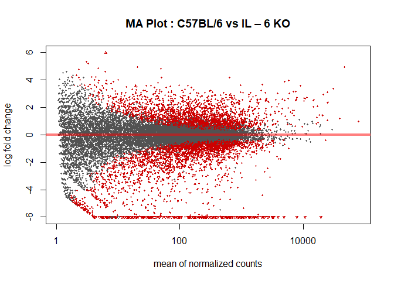

``` r
expgenes_C57_KO_res.shrunk = lfcShrink(cds, contrast = c("condition","C57","KO") )
```

    ## using 'normal' for LFC shrinkage, the Normal prior from Love et al (2014).
    ## 
    ## Note that type='apeglm' and type='ashr' have shown to have less bias than type='normal'.
    ## See ?lfcShrink for more details on shrinkage type, and the DESeq2 vignette.
    ## Reference: https://doi.org/10.1093/bioinformatics/bty895

``` r
plotMA(expgenes_C57_KO_res.shrunk,
       ylim = c(-6,6),
       main = "MA Plot : C57BL/6 vs IL – 6 KO - shrunk")
```

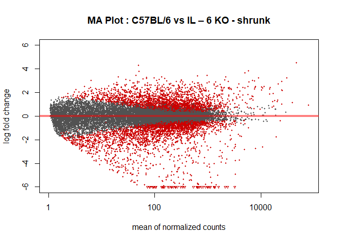

``` r
plotMA(expgenes_C57_Balb_res,
       ylim = c(-6,6),
       main = "MA Plot : C57BL/6 vs BALB/c")
```

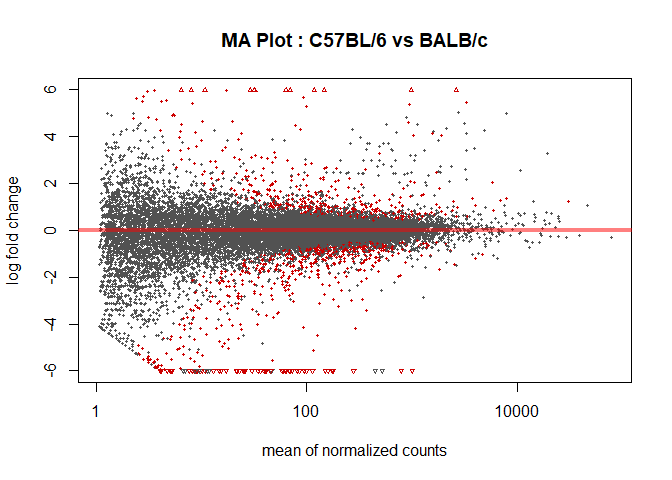

``` r
expgenes_C57_Balb_res.shrunk = lfcShrink(cds, contrast = c("condition","C57","Balb") )
```

    ## using 'normal' for LFC shrinkage, the Normal prior from Love et al (2014).
    ## 
    ## Note that type='apeglm' and type='ashr' have shown to have less bias than type='normal'.
    ## See ?lfcShrink for more details on shrinkage type, and the DESeq2 vignette.
    ## Reference: https://doi.org/10.1093/bioinformatics/bty895

``` r
plotMA(expgenes_C57_Balb_res.shrunk,
       ylim = c(-6,6),
       main = "MA Plot : C57BL/6 vs BALB/c - shrunk")
```

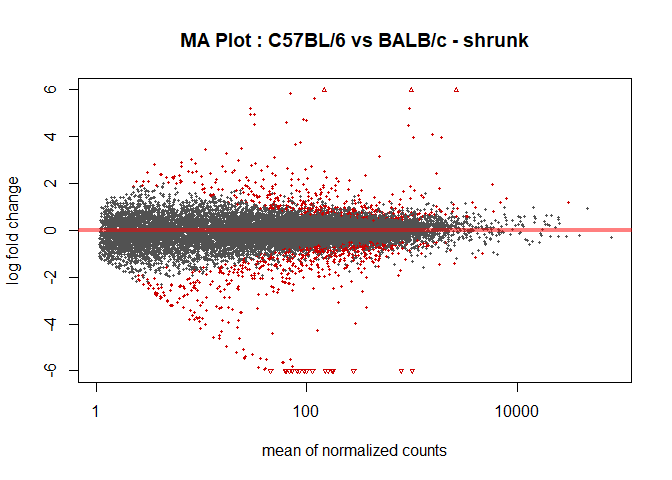

``` r
plotMA(expgenes_KO_Balb_res,
       ylim = c(-6,6),
       main = "MA Plot : IL – 6 KO vs BALB/c")
```

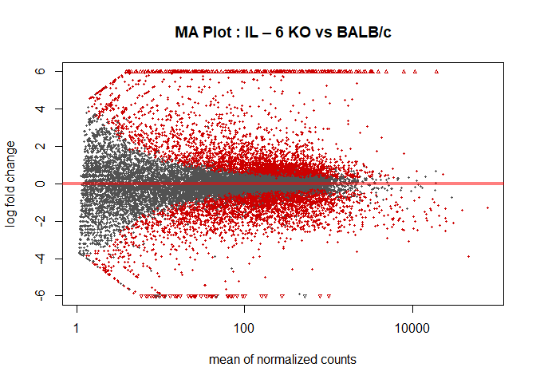

``` r
expgenes_KO_Balb_res.shrunk = lfcShrink(cds, contrast = c("condition","KO","Balb") )
```

    ## using 'normal' for LFC shrinkage, the Normal prior from Love et al (2014).
    ## 
    ## Note that type='apeglm' and type='ashr' have shown to have less bias than type='normal'.
    ## See ?lfcShrink for more details on shrinkage type, and the DESeq2 vignette.
    ## Reference: https://doi.org/10.1093/bioinformatics/bty895

``` r
plotMA(expgenes_KO_Balb_res.shrunk,
       ylim = c(-6,6),
       main = "MA Plot : IL – 6 KO vs BALB/c - shrunk")
```

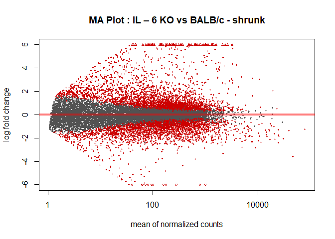

# 6 Determining Differentially Expressed Genes

Next, to begin determining which genes are differnentially expressed, we
will sort our results list according to the adjusted pvalue (not the raw
pvalue bc the dataset is very large). Then we will filter out genes with
an adjusted pvalue more than 0.05.

Before we do this, we should remove results that have any NAs in
them.

``` r
expgenes_C57_KO_res.shrunk = expgenes_C57_KO_res.shrunk[complete.cases(expgenes_C57_KO_res.shrunk),]
expgenes_C57_Balb_res.shrunk = expgenes_C57_Balb_res.shrunk[complete.cases(expgenes_C57_Balb_res.shrunk),]
expgenes_KO_Balb_res.shrunk = expgenes_KO_Balb_res.shrunk[complete.cases(expgenes_KO_Balb_res.shrunk),]
```

Now we can sort by
`padj`

``` r
c57_KO_res_sh_ordered = expgenes_C57_KO_res.shrunk[order(expgenes_C57_KO_res.shrunk$padj),]
c57_Balb_res_sh_ordered = expgenes_C57_Balb_res.shrunk[order(expgenes_C57_Balb_res.shrunk$padj),]
KO_Balb_res_sh_ordered = expgenes_KO_Balb_res.shrunk[order(expgenes_KO_Balb_res.shrunk$padj),]
```

Once sorted, we can remove genes with a padj \>
0.05.

``` r
c57_KO_res_fdr = c57_KO_res_sh_ordered[c57_KO_res_sh_ordered$padj<=0.05,]
c57_Balb_res_fdr = c57_Balb_res_sh_ordered[c57_Balb_res_sh_ordered$padj<=0.05,]
KO_Balb_res_fdr = KO_Balb_res_sh_ordered[KO_Balb_res_sh_ordered$padj<=0.05,]
```

The log2(fold-change) is the log-ratio of a gene’s or a transcript’s
expression values in two different conditions. By filtering out genes
with a log2fold between 1 and -1, we should be left with the genes that
are most likely to be differentially
expressed.

``` r
c57_KO_res_fdr_lc_cut_1 = c57_KO_res_fdr[c57_KO_res_fdr$log2FoldChange>=1,]
c57_KO_res_fdr_lc_cut_2 = c57_KO_res_fdr[c57_KO_res_fdr$log2FoldChange<= -1,]

c57_KO_diff_exp = c(row.names(c57_KO_res_fdr_lc_cut_1), row.names(c57_KO_res_fdr_lc_cut_2)) #list of diff exp genes
summary(c57_KO_diff_exp) # 3683 diff exp genes
```

    ##    Length     Class      Mode 
    ##      2771 character character

``` r
c57_Balb_res_fdr_lc_cut_1 = c57_Balb_res_fdr[c57_Balb_res_fdr$log2FoldChange>=1,]
c57_Balb_res_fdr_lc_cut_2 = c57_Balb_res_fdr[c57_Balb_res_fdr$log2FoldChange<= -1,]

c57_Balb_diff_exp = c(row.names(c57_Balb_res_fdr_lc_cut_1), row.names(c57_Balb_res_fdr_lc_cut_2)) #list of diff exp genes
summary(c57_Balb_diff_exp) # 499 diff exp genes
```

    ##    Length     Class      Mode 
    ##       488 character character

``` r
KO_Balb_res_fdr_lc_cut_1 = KO_Balb_res_fdr[KO_Balb_res_fdr$log2FoldChange>=1,]
KO_Balb_res_fdr_lc_cut_2 = KO_Balb_res_fdr[KO_Balb_res_fdr$log2FoldChange<= -1,]

KO_Balb_diff_exp = c(row.names(KO_Balb_res_fdr_lc_cut_1), row.names(KO_Balb_res_fdr_lc_cut_2)) #list of diff exp genes
summary(KO_Balb_diff_exp) #1468 diff exp genes
```

    ##    Length     Class      Mode 
    ##      3125 character character

## Volcano Plots

Volcano Plots are a good way to visualize differentially expressed
genes.

``` r
par(mar=c(5,5,5,5), cex=1.0, cex.main=1.4, cex.axis=1.4, cex.lab=1.4)

topT1 <- as.data.frame(c57_KO_res_sh_ordered)

#Adjusted P values (FDR Q values)
with(topT1, plot(log2FoldChange, -log10(padj), pch=20, main="Volcano plot C57BL/6 vs IL-6 KO", cex=1.0, xlab=bquote(~Log[2]~fold~change), ylab=bquote(~-log[10]~Q~value)))

with(subset(topT1, padj<0.05 & abs(log2FoldChange)>1), points(log2FoldChange, -log10(padj), pch=20, col="red", cex=0.5))

#Add lines for absolute FC>2 and P-value cut-off at FDR Q<0.05
abline(v=0, col="black", lty=3, lwd=1.0)
abline(v=-1, col="black", lty=4, lwd=2.0)
abline(v=1, col="black", lty=4, lwd=2.0)
abline(h=-log10(max(topT1$pvalue[topT1$padj<0.05], na.rm=TRUE)), col="black", lty=4, lwd=2.0)
```

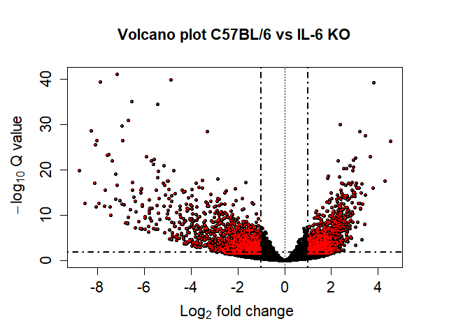<!-- -->

``` r
##########


par(mar=c(5,5,5,5), cex=1.0, cex.main=1.4, cex.axis=1.4, cex.lab=1.4)

topT2 <- as.data.frame(c57_Balb_res_sh_ordered)

#Adjusted P values (FDR Q values)
with(topT2, plot(log2FoldChange, -log10(padj), pch=20, main="Volcano plot C57BL/6 vs BALB/c", cex=1.0, xlab=bquote(~Log[2]~fold~change), ylab=bquote(~-log[10]~Q~value)))

with(subset(topT2, padj<0.05 & abs(log2FoldChange)>1), points(log2FoldChange, -log10(padj), pch=20, col="red", cex=0.5))

#Add lines for absolute FC>2 and P-value cut-off at FDR Q<0.05
abline(v=0, col="black", lty=3, lwd=1.0)
abline(v=-1, col="black", lty=4, lwd=2.0)
abline(v=1, col="black", lty=4, lwd=2.0)
abline(h=-log10(max(topT2$pvalue[topT2$padj<0.05], na.rm=TRUE)), col="black", lty=4, lwd=2.0)
```

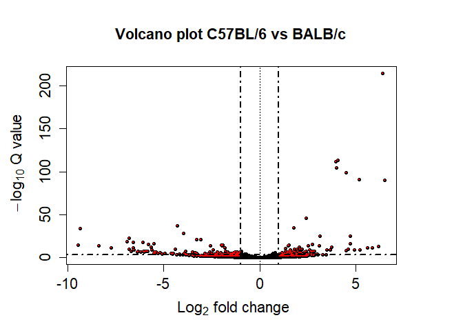<!-- -->

``` r
##########


par(mar=c(5,5,5,5), cex=1.0, cex.main=1.4, cex.axis=1.4, cex.lab=1.4)

topT3 <- as.data.frame(KO_Balb_res_sh_ordered)

#Adjusted P values (FDR Q values)
with(topT3, plot(log2FoldChange, -log10(padj), pch=20, main="Volcano plot IL - 6 KO vs BALB/c", cex=1.0, xlab=bquote(~Log[2]~fold~change), ylab=bquote(~-log[10]~Q~value)))

with(subset(topT3, padj<0.05 & abs(log2FoldChange)>1), points(log2FoldChange, -log10(padj), pch=20, col="red", cex=0.5))

#Add lines for absolute FC>2 and P-value cut-off at FDR Q<0.05
abline(v=0, col="black", lty=3, lwd=1.0)
abline(v=-1, col="black", lty=4, lwd=2.0)
abline(v=1, col="black", lty=4, lwd=2.0)
abline(h=-log10(max(topT3$pvalue[topT3$padj<0.05], na.rm=TRUE)), col="black", lty=4, lwd=2.0)
```

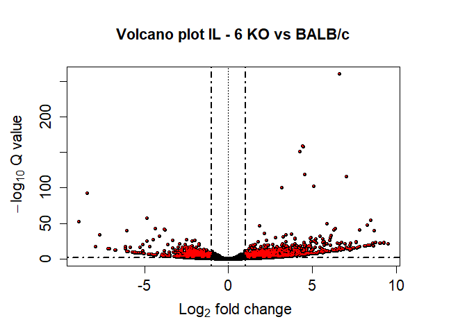<!-- --> \# 7
Clustering

Clustering gene expression data allows us to identify substructures in
the data and identify groups of genes that behave similarly.

To begin clustering, normalized values need to be retreived

``` r
rawcounts.matrix = counts(cds, normalized = F)
normalizedcounts.matrix = counts(cds,normalized=T)
head(normalizedcounts.matrix)
```

    ##                    GSM3360686_C57 GSM3360687_C57 GSM3360688_KO GSM3360689_KO
    ## ENSMUSG00000051951       9.764242       4.039832      9.887460      7.644548
    ## ENSMUSG00000025900      13.832676      13.129455      4.237483      7.644548
    ## ENSMUSG00000025902      72.418128      73.726942     16.949932     29.486114
    ## ENSMUSG00000033845     235.155493     268.648857    231.649074    164.903825
    ## ENSMUSG00000025903      56.144391      29.288785     40.962336     45.867289
    ## ENSMUSG00000104217      12.205302       3.029874     14.124944      5.460392
    ##                    GSM3360690_KO GSM3360691_Balb GSM3360692_Balb
    ## ENSMUSG00000051951      3.362812       12.655684        8.971888
    ## ENSMUSG00000025900      1.120937        5.905986       12.560643
    ## ENSMUSG00000025902     21.297807       70.028120       49.345382
    ## ENSMUSG00000033845    153.568399      327.360369      319.399200
    ## ENSMUSG00000025903     42.595614       64.965846       44.859438
    ## ENSMUSG00000104217      7.846561        6.749698        9.869076
    ##                    GSM3360693_Balb
    ## ENSMUSG00000051951        6.295077
    ## ENSMUSG00000025900        9.892264
    ## ENSMUSG00000025902       43.166243
    ## ENSMUSG00000033845      275.184798
    ## ENSMUSG00000025903       50.360617
    ## ENSMUSG00000104217        8.992967

Now we are going to subset our normalized counts matrix for each result
object

``` r
diffexp_norm_C57_KO = subset(normalizedcounts.matrix, rownames(normalizedcounts.matrix) %in% c57_KO_diff_exp)
diffexp_norm_C57_Balb = subset(normalizedcounts.matrix, rownames(normalizedcounts.matrix) %in% c57_Balb_diff_exp)
diffexp_norm_KO_Balb = subset(normalizedcounts.matrix, rownames(normalizedcounts.matrix) %in% KO_Balb_diff_exp)
```

Then we will perform a peason correlation to help get the distance
objects needed to perform
clustering.

``` r
diffexp_norm_C57_KO.cor = cor(t(diffexp_norm_C57_KO), method = "pearson")
diffexp_norm_C57_Balb.cor = cor(t(diffexp_norm_C57_Balb), method = "pearson")
diffexp_norm_KO_Balb.cor = cor(t(diffexp_norm_KO_Balb), method = "pearson")
```

With our correlations we can create distance objects

``` r
diffexp_C57_KO.dist = as.dist(1 - diffexp_norm_C57_KO.cor)
diffexp_C57_Balb.dist = as.dist(1 - diffexp_norm_C57_Balb.cor)
diffexp_KO_Balb.dist = as.dist(1 - diffexp_norm_KO_Balb.cor)
```

Now that we have distance objects, we can begin clustering

``` r
diffexp_C57_KO.clust = hclust(diffexp_C57_KO.dist, method = "average")
diffexp_C57_Balb.clust = hclust(diffexp_C57_Balb.dist, method = "average")
diffexp_KO_Balb.clust = hclust(diffexp_KO_Balb.dist, method = "average")
```

Plotting the clusters may help visualize commonalitys in the
differentially expressed
genes

``` r
plot(diffexp_C57_KO.clust) # seems like 2 main groups
```

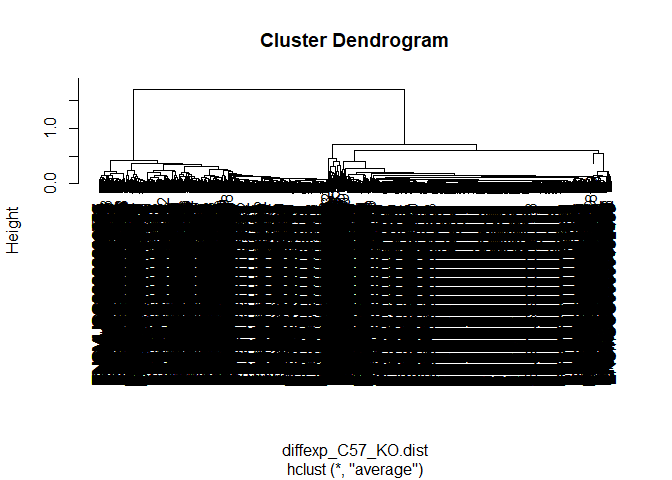

``` r
plot(diffexp_C57_Balb.clust)# also seems like 2 main groups but the right side is more split
```

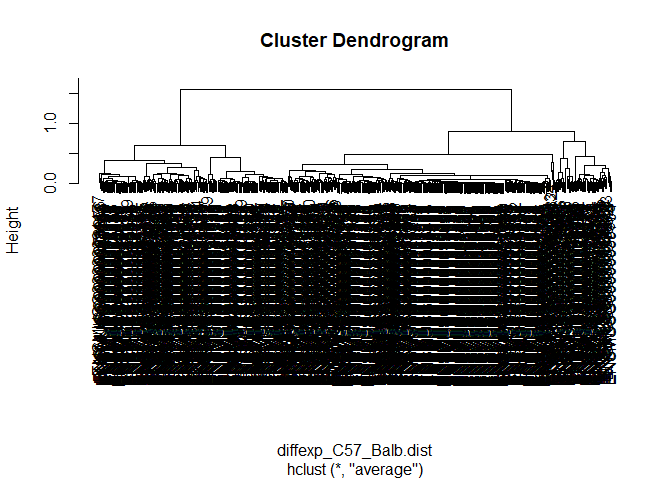

``` r
plot(diffexp_KO_Balb.clust) # seems like 2 main groups
```

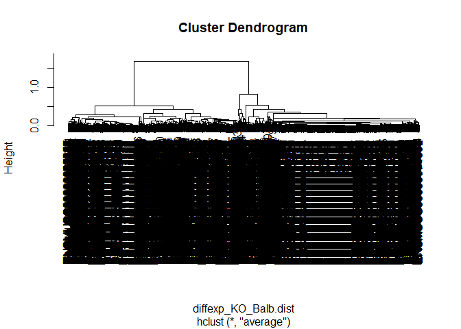

Each cluster will be split into 2 main groups

``` r
diffexp_C57_KO.clust.groups = cutree(diffexp_C57_KO.clust, k = 2)
diffexp_C57_Balb.clust.groups = cutree(diffexp_C57_Balb.clust, k = 2)
diffexp_KO_Balb.clust.groups = cutree(diffexp_KO_Balb.clust, k = 2)
```

To determine how many genes are in each group,

``` r
table(diffexp_C57_KO.clust.groups) # 1958 1725 
```

    ## diffexp_C57_KO.clust.groups
    ##    1    2 
    ## 1240 1531

``` r
table(diffexp_C57_Balb.clust.groups) # 386 113 
```

    ## diffexp_C57_Balb.clust.groups
    ##   1   2 
    ## 308 180

``` r
table(diffexp_KO_Balb.clust.groups) # 630 838 
```

    ## diffexp_KO_Balb.clust.groups
    ##    1    2 
    ## 1514 1611

Now we will subset our clusters to get vectors of the Gene IDs in each
cluster group.

``` r
cluster1.1genes = diffexp_norm_C57_KO[diffexp_C57_KO.clust.groups == 1,]
group1.1=rownames(cluster1.1genes)
cluster1.2genes = diffexp_norm_C57_KO[diffexp_C57_KO.clust.groups == 2,]
group1.2=rownames(cluster1.2genes)
# cluster1.3genes = diffexp_norm_C57_KO[diffexp_C57_KO.clust.groups == 3,]
# group1.3=rownames(cluster1.1genes)

cluster2.1genes = diffexp_norm_C57_Balb[diffexp_C57_Balb.clust.groups==1,]
group2.1=rownames(cluster2.1genes)
cluster2.2genes = diffexp_norm_C57_Balb[diffexp_C57_Balb.clust.groups==2,]
group2.2=rownames(cluster2.2genes)
# cluster2.3genes = diffexp_norm_C57_Balb[diffexp_C57_Balb.clust.groups==3,]
# group2.3=rownames(cluster2.1genes)

cluster3.1genes = diffexp_norm_KO_Balb[diffexp_KO_Balb.clust.groups==1,]
group3.1=rownames(cluster3.1genes)
cluster3.2genes = diffexp_norm_KO_Balb[diffexp_KO_Balb.clust.groups==2,]
group3.2=rownames(cluster3.2genes)
# cluster3.3genes = diffexp_norm_KO_Balb[diffexp_KO_Balb.clust.groups==3,]
# group3.3=rownames(cluster3.1genes)
```

# Heatmaps

A common method of visualising gene expression data is to display it as
a heatmap. The color and intensity of the boxes is used to represent
*changes* (not absolute values) of gene expression.

To contruct Heatmaps the `gplots` library needs to be called and a
correlation function needs to be defined (since we want to use a Pearson
Correlation)

``` r
library(gplots)
```

    ## 
    ## Attaching package: 'gplots'

    ## The following object is masked from 'package:IRanges':
    ## 
    ##     space

    ## The following object is masked from 'package:S4Vectors':
    ## 
    ##     space

    ## The following object is masked from 'package:stats':
    ## 
    ##     lowess

``` r
corfun = function(x){
        return( as.dist(1-cor(t(x), method = 'pearson')))
}
```

`heatmap.2` was used to make the heat maps for each cluster group.

``` r
my_palette <- colorRampPalette(c("red","black", "green"), space = "rgb")


heatmap.2(as.matrix(cluster1.1genes),
          distfun = corfun,
          scale="row",
          Colv = F,
          dendrogram = "row",
          trace = "none",
          main = "Cluster C57BL/6 vs IL – 6 KO
          Group 1 Heat Map",
          keysize = 1.5,
          symkey = T,
          col = my_palette,
          cexRow=1,
          cexCol=1,
          margins = c(7,11),
          srtCol = 45)
```

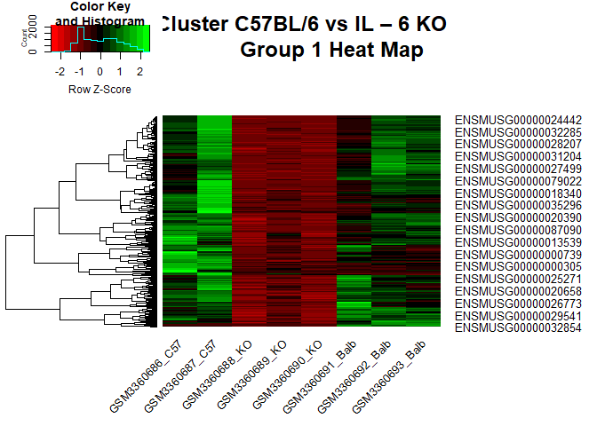

``` r
heatmap.2(as.matrix(cluster1.2genes),
          distfun = corfun,
          scale="row",
          Colv = F,
          dendrogram = "row",
          trace = "none",
          main = "Cluster C57BL/6 vs IL – 6 KO 
          Group 2 Heat Map",
          keysize = 1.5,
          symkey = T,
          col = my_palette,
          cexRow=1,
          cexCol=1,
          margins = c(7,11),
          srtCol = 45)
```

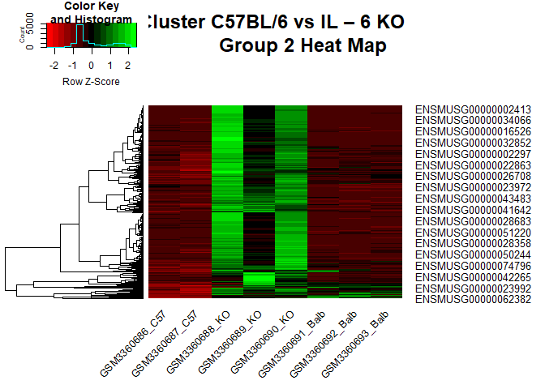

``` r
# heatmap.2(as.matrix(cluster1.3genes),
#           distfun = corfun,
#           scale="row",
#           Colv = F,
#           dendrogram = "row",
#           trace = "none",
#           main = "Cluster 1.3 Heat Map",
#           keysize = 1.5,
#           symkey = T,
#           col = my_palette,
#           cexRow=1,
#           cexCol=1,
#           margins = c(7,11),
#           srtCol = 45)


heatmap.2(as.matrix(cluster2.1genes),
          distfun = corfun,
          scale="row",
          Colv = F,
          dendrogram = "row",
          trace = "none",
          main = "Cluster C57BL/6 vs BALB/c 
          Group 1 Heat Map",
          keysize = 1.5,
          symkey = T,
          col = my_palette,
          cexRow=1,
          cexCol=1,
          margins = c(7,11),
          srtCol = 45)
```

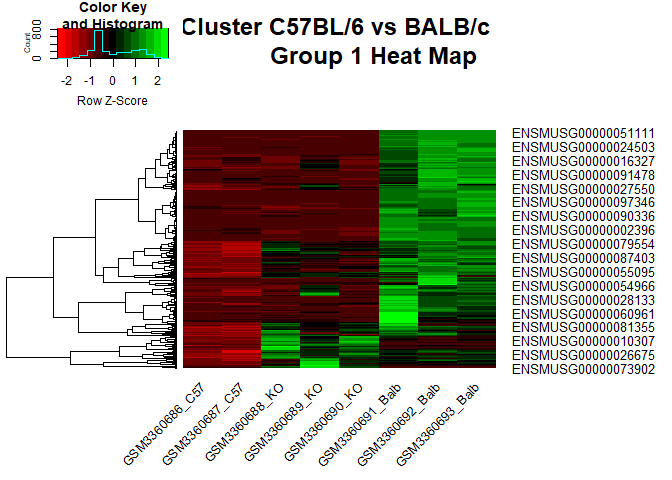

``` r
heatmap.2(as.matrix(cluster2.2genes),
          distfun = corfun,
          scale="row",
          Colv = F,
          dendrogram = "row",
          trace = "none",
          main = "Cluster C57BL/6 vs BALB/c 
          Group 2 Heat Map",
          keysize = 1.5,
          symkey = T,
          col = my_palette,
          cexRow=1,
          cexCol=1,
          margins = c(7,11),
          srtCol = 45)
```

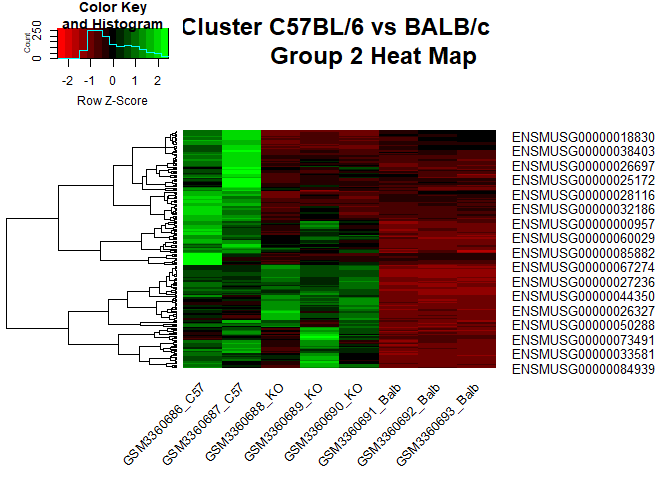

``` r
# heatmap.2(as.matrix(cluster2.3genes),
#           distfun = corfun,
#           scale="row",
#           Colv = F,
#           dendrogram = "row",
#           trace = "none",
#           main = "Cluster 2.3 Heat Map",
#           keysize = 1.5,
#           symkey = T,
#           col = my_palette,
#           cexRow=1,
#           cexCol=1,
#           margins = c(7,11),
#           srtCol = 45)


heatmap.2(as.matrix(cluster3.1genes),
          distfun = corfun,
          scale="row",
          Colv = F,
          dendrogram = "row",
          trace = "none",
          main = "Cluster IL – 6 KO vs BALB/c 
          Group 1 Heat Map",
          keysize = 1.5,
          symkey = T,
          col = my_palette,
          cexRow=1,
          cexCol=1,
          margins = c(7,11),
          srtCol = 45)
```

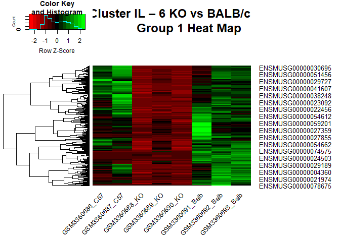

``` r
heatmap.2(as.matrix(cluster3.2genes),
          distfun = corfun,
          scale="row",
          Colv = F,
          dendrogram = "row",
          trace = "none",
          main = "Cluster IL – 6 KO vs BALB/c 
          Group 2 Heat Map",
          keysize = 1.5,
          symkey = T,
          col = my_palette,
          cexRow=1,
          cexCol=1,
          margins = c(7,11),
          srtCol = 45)
```

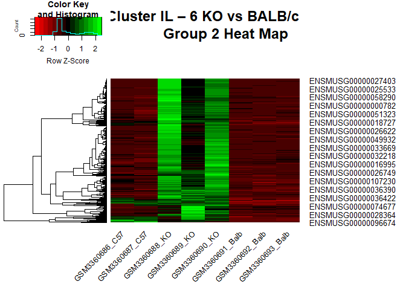

``` r
# heatmap.2(as.matrix(cluster3.3genes),
#           distfun = corfun,
#           scale="row",
#           Colv = F,
#           dendrogram = "row",
#           trace = "none",
#           main = "Cluster 3.3 Heat Map",
#           keysize = 1.5,
#           symkey = T,
#           col = my_palette,
#           cexRow=1,
#           cexCol=1,
#           margins = c(7,11),
#           srtCol = 45)
```

# Gene Ontology Enrichment Analysis

Now that we constructed heat maps to visualize our gene expression data,
we can begin our GO enrichment analysis. When given a set of genes that
are up-regulated under certain conditions, an enrichment analysis will
find which GO terms are over-represented (or under-represented) using
annotations for that gene set.

To begin our GO Enrichment Analysis, we need to call the following
libraries,

``` r
#BiocManager::install("org.Mm.eg.db")
library(Category)
```

    ## Loading required package: AnnotationDbi

    ## Loading required package: Matrix

    ## 
    ## Attaching package: 'Matrix'

    ## The following object is masked from 'package:S4Vectors':
    ## 
    ##     expand

``` r
library("annotate")
```

    ## Loading required package: XML

``` r
library("org.Mm.eg.db") #   Mus musculus database
```

    ## 

``` r
library("GOstats")
```

    ## Loading required package: graph

    ## 
    ## Attaching package: 'graph'

    ## The following object is masked from 'package:XML':
    ## 
    ##     addNode

    ## 

    ## 
    ## Attaching package: 'GOstats'

    ## The following object is masked from 'package:AnnotationDbi':
    ## 
    ##     makeGOGraph

``` r
library(GO.db)
```

Once the proper libraries are loaded, a hypergeometric test will be
conducted to determine which genes are over represented using the
`hyperGtest` function. The parameters for this function includes a gene
ID vector, a gene universe vector, an annotation database, p value
cutoff among other things. Because the function expects Entrez gene IDs
and our dataset provides Ensembl IDs, we can convert them to Entrez IDs
in order for this to work.

To convert Ensembl IDs to Entrez IDs, the `select` function was used.
This was done for the gene IDs for each of our comparisons as well as
the gene universe.

``` r
ensemble2entre_gene_ids1 = select(org.Mm.eg.db,
                                  columns = "ENTREZID",
                                  keys = rownames(diffexp_norm_C57_KO),
                                  keytype = "ENSEMBL")
```

    ## 'select()' returned 1:many mapping between keys and columns

``` r
ensemble2entre_gene_ids2 = select(org.Mm.eg.db,
                                  columns = "ENTREZID",
                                  keys = rownames(diffexp_norm_C57_Balb),
                                  keytype = "ENSEMBL")
```

    ## 'select()' returned 1:many mapping between keys and columns

``` r
ensemble2entre_gene_ids3 = select(org.Mm.eg.db,
                                  columns = "ENTREZID", 
                                  keys = rownames(diffexp_norm_KO_Balb),
                                  keytype = "ENSEMBL")
```

    ## 'select()' returned 1:many mapping between keys and columns

``` r
ensemble2entre_univ = select(org.Mm.eg.db, 
                             columns = "ENTREZID", 
                             keys = rownames(normalizedcounts.matrix),
                             keytype = "ENSEMBL")
```

    ## 'select()' returned 1:many mapping between keys and columns

``` r
head(ensemble2entre_gene_ids1)
```

    ##              ENSEMBL ENTREZID
    ## 1 ENSMUSG00000025902    20671
    ## 2 ENSMUSG00000025909    71096
    ## 3 ENSMUSG00000025911    76187
    ## 4 ENSMUSG00000025915   170755
    ## 5 ENSMUSG00000046101   240697
    ## 6 ENSMUSG00000057715   320492

``` r
g1.1_id = select(org.Mm.eg.db,
                 columns = "ENTREZID",
                 keys = group1.1,
                 keytype = "ENSEMBL")
```

    ## 'select()' returned 1:many mapping between keys and columns

``` r
g1.2_id = select(org.Mm.eg.db,
                 columns = "ENTREZID",
                 keys = group1.2,
                 keytype = "ENSEMBL")
```

    ## 'select()' returned 1:many mapping between keys and columns

``` r
# g1.3_id = select(org.Mm.eg.db,
#                  columns = "ENTREZID",
#                  keys = group1.3,
#                  keytype = "ENSEMBL")
g2.1_id = select(org.Mm.eg.db,
                 columns = "ENTREZID",
                 keys = group2.1,
                 keytype = "ENSEMBL")
```

    ## 'select()' returned 1:many mapping between keys and columns

``` r
g2.2_id = select(org.Mm.eg.db,
                 columns = "ENTREZID",
                 keys = group2.2,
                 keytype = "ENSEMBL")
```

    ## 'select()' returned 1:many mapping between keys and columns

``` r
# g2.3_id = select(org.Mm.eg.db,
#                  columns = "ENTREZID",
#                  keys = group2.3,
#                  keytype = "ENSEMBL")
g3.1_id = select(org.Mm.eg.db,
                 columns = "ENTREZID",
                 keys = group3.1,
                 keytype = "ENSEMBL")
```

    ## 'select()' returned 1:many mapping between keys and columns

``` r
g3.2_id = select(org.Mm.eg.db,
                 columns = "ENTREZID",
                 keys = group3.2,
                 keytype = "ENSEMBL")
```

    ## 'select()' returned 1:many mapping between keys and columns

``` r
# g3.3_id = select(org.Mm.eg.db,
#                  columns = "ENTREZID",
#                  keys = group3.3,
#                  keytype = "ENSEMBL")
```

Now that our Ensembl Gene IDs are converted to EntrezIDs, we can begin
defining our paramters for the `hyperGtest` function.

``` r
param1 = new("GOHyperGParams",
            geneIds = ensemble2entre_gene_ids1$ENTREZID,
            universeGeneIds = ensemble2entre_univ$ENTREZID,
            annotation = "org.Mm.eg",
            ontology = "BP",
            pvalueCutoff = 0.001,
            conditional = T,
            testDirection = "over")
```

    ## Warning in makeValidParams(.Object): removing duplicate IDs in geneIds

    ## Warning in makeValidParams(.Object): removing duplicate IDs in universeGeneIds

``` r
param2 = new("GOHyperGParams",
             geneIds = ensemble2entre_gene_ids2$ENTREZID,
             universeGeneIds = ensemble2entre_univ$ENTREZID,
             annotation = "org.Mm.eg.db",
             ontology = "BP",
             pvalueCutoff = 0.001,
             conditional = T,
             testDirection = "over")
```

    ## Warning in makeValidParams(.Object): removing duplicate IDs in geneIds
    
    ## Warning in makeValidParams(.Object): removing duplicate IDs in universeGeneIds

``` r
param3 = new("GOHyperGParams",
             geneIds = ensemble2entre_gene_ids3$ENTREZID,
             universeGeneIds = ensemble2entre_univ$ENTREZID,
             annotation = "org.Mm.eg.db",
             ontology = "BP",
             pvalueCutoff = 0.001,
             conditional = T,
             testDirection = "over")
```

    ## Warning in makeValidParams(.Object): removing duplicate IDs in geneIds
    
    ## Warning in makeValidParams(.Object): removing duplicate IDs in universeGeneIds

``` r
group1.1param = new("GOHyperGParams",
             geneIds = g1.1_id$ENTREZID,
             universeGeneIds = ensemble2entre_univ$ENTREZID,
             annotation = "org.Mm.eg.db",
             ontology = "BP",
             pvalueCutoff = 0.001,
             conditional = T,
             testDirection = "over")
```

    ## Warning in makeValidParams(.Object): removing duplicate IDs in geneIds

    ## Warning in makeValidParams(.Object): removing duplicate IDs in universeGeneIds

``` r
group1.2param = new("GOHyperGParams",
             geneIds = g1.2_id$ENTREZID,
             universeGeneIds = ensemble2entre_univ$ENTREZID,
             annotation = "org.Mm.eg.db",
             ontology = "BP",
             pvalueCutoff = 0.001,
             conditional = T,
             testDirection = "over")
```

    ## Warning in makeValidParams(.Object): removing duplicate IDs in geneIds
    
    ## Warning in makeValidParams(.Object): removing duplicate IDs in universeGeneIds

``` r
# group1.3param = new("GOHyperGParams",
#              geneIds = g1.3_id$ENTREZID,
#              universeGeneIds = ensemble2entre_univ$ENTREZID,
#              annotation = "org.Mm.eg.db",
#              ontology = "BP",
#              pvalueCutoff = 0.001,
#              conditional = T,
#              testDirection = "over")
group2.1param = new("GOHyperGParams",
             geneIds = g2.1_id$ENTREZID,
             universeGeneIds = ensemble2entre_univ$ENTREZID,
             annotation = "org.Mm.eg.db",
             ontology = "BP",
             pvalueCutoff = 0.001,
             conditional = T,
             testDirection = "over")
```

    ## Warning in makeValidParams(.Object): removing duplicate IDs in geneIds
    
    ## Warning in makeValidParams(.Object): removing duplicate IDs in universeGeneIds

``` r
group2.2param = new("GOHyperGParams",
             geneIds = g2.2_id$ENTREZID,
             universeGeneIds = ensemble2entre_univ$ENTREZID,
             annotation = "org.Mm.eg.db",
             ontology = "BP",
             pvalueCutoff = 0.001,
             conditional = T,
             testDirection = "over")
```

    ## Warning in makeValidParams(.Object): removing duplicate IDs in geneIds
    
    ## Warning in makeValidParams(.Object): removing duplicate IDs in universeGeneIds

``` r
# group2.3param = new("GOHyperGParams",
#              geneIds = g2.3_id$ENTREZID,
#              universeGeneIds = ensemble2entre_univ$ENTREZID,
#              annotation = "org.Mm.eg.db",
#              ontology = "BP",
#              pvalueCutoff = 0.001,
#              conditional = T,
#              testDirection = "over")
group3.1param = new("GOHyperGParams",
             geneIds = g3.1_id$ENTREZID,
             universeGeneIds = ensemble2entre_univ$ENTREZID,
             annotation = "org.Mm.eg.db",
             ontology = "BP",
             pvalueCutoff = 0.001,
             conditional = T,
             testDirection = "over")
```

    ## Warning in makeValidParams(.Object): removing duplicate IDs in geneIds
    
    ## Warning in makeValidParams(.Object): removing duplicate IDs in universeGeneIds

``` r
group3.2param = new("GOHyperGParams",
             geneIds = g3.2_id$ENTREZID,
             universeGeneIds = ensemble2entre_univ$ENTREZID,
             annotation = "org.Mm.eg.db",
             ontology = "BP",
             pvalueCutoff = 0.001,
             conditional = T,
             testDirection = "over")
```

    ## Warning in makeValidParams(.Object): removing duplicate IDs in geneIds
    
    ## Warning in makeValidParams(.Object): removing duplicate IDs in universeGeneIds

``` r
# group3.3param = new("GOHyperGParams",
#              geneIds = g3.3_id$ENTREZID,
#              universeGeneIds = ensemble2entre_univ$ENTREZID,
#              annotation = "org.Mm.eg.db",
#              ontology = "BP",
#              pvalueCutoff = 0.001,
#              conditional = T,
#              testDirection = "over")
```

And since our parameters are ready, we can finally use the `hyperGtest`
function to determine which genes are over expressed in each of the
comparisons.

``` r
overRepresented1 = hyperGTest(param1)
head(summary(overRepresented1), n = 20)
```

    ##        GOBPID       Pvalue OddsRatio   ExpCount Count Size
    ## 1  GO:0006811 2.714954e-15  1.758972 207.694801   312 1294
    ## 2  GO:0007275 1.316899e-13  1.416707 697.719707   850 4347
    ## 3  GO:0042692 1.541319e-13  2.658212  47.931696    99  300
    ## 4  GO:0044057 7.207636e-13  2.153481  79.932002   142  498
    ## 5  GO:0060537 7.634841e-13  2.269748  68.215062   126  425
    ## 6  GO:0045214 1.614396e-11  7.297762   8.025301    29   50
    ## 7  GO:0072511 6.806949e-11  2.140286  66.449496   118  414
    ## 8  GO:0055085 8.885802e-11  1.658280 172.062463   250 1072
    ## 9  GO:0098660 3.020242e-10  1.978498  79.302912   133  497
    ## 10 GO:0010927 5.297852e-10  3.614406  17.816169    45  111
    ## 11 GO:0010959 1.119589e-09  2.124141  58.745207   104  366
    ## 12 GO:0007517 1.488243e-09  2.969001  24.544603    55  155
    ## 13 GO:0030855 2.866715e-09  1.877581  84.265665   136  525
    ## 14 GO:0003015 3.949129e-09  2.636889  30.496145    63  190
    ## 15 GO:0050801 7.263084e-09  1.741136 107.057521   163  667
    ## 16 GO:0008544 7.318066e-09  2.305084  41.430421    78  259
    ## 17 GO:0006813 3.142997e-08  2.475743  31.298676    62  195
    ## 18 GO:0008016 3.647035e-08  2.758709  23.915398    51  149
    ## 19 GO:0071805 4.290957e-08  2.676530  25.359953    53  158
    ## 20 GO:0022898 1.818390e-07  2.270542  34.829808    65  217
    ##                                                     Term
    ## 1                                          ion transport
    ## 2                     multicellular organism development
    ## 3                            muscle cell differentiation
    ## 4                           regulation of system process
    ## 5                              muscle tissue development
    ## 6                                 sarcomere organization
    ## 7                    divalent inorganic cation transport
    ## 8                                transmembrane transport
    ## 9                  inorganic ion transmembrane transport
    ## 10 cellular component assembly involved in morphogenesis
    ## 11                     regulation of metal ion transport
    ## 12                              muscle organ development
    ## 13                       epithelial cell differentiation
    ## 14                                         heart process
    ## 15                                       ion homeostasis
    ## 16                                 epidermis development
    ## 17                               potassium ion transport
    ## 18                       regulation of heart contraction
    ## 19                 potassium ion transmembrane transport
    ## 20      regulation of transmembrane transporter activity

``` r
overRepresented2 = hyperGTest(param2)
head(summary(overRepresented2), n = 20)
```

    ##        GOBPID       Pvalue OddsRatio   ExpCount Count Size
    ## 1  GO:0002486 4.918550e-06 17.973290 0.47308427     6   20
    ## 2  GO:0018149 5.957095e-06  8.081398 1.32463596     9   56
    ## 3  GO:0002476 6.749363e-06 16.773938 0.49673849     6   21
    ## 4  GO:0001916 9.822967e-06 11.313811 0.78058905     7   33
    ## 5  GO:0002475 2.033268e-05 13.239004 0.59135534     6   25
    ## 6  GO:0019885 3.265248e-05 11.976528 0.63866377     6   27
    ## 7  GO:0048002 4.779771e-05  7.013295 1.32463596     8   56
    ## 8  GO:0019883 5.034652e-05 10.933613 0.68597219     6   29
    ## 9  GO:0031343 5.361787e-05  5.927946 1.72675759     9   73
    ## 10 GO:0002685 1.395124e-04  3.455410 4.39968373    14  186
    ## 11 GO:0002181 4.210541e-04  4.943858 1.79772023     8   76
    ## 12 GO:0009624 5.580000e-04       Inf 0.04730843     2    2
    ## 13 GO:0090022 6.305123e-04  8.357627 0.70962641     5   30
    ## 14 GO:0048247 7.078625e-04  6.279603 1.08809383     6   46
    ##                                                                                                                 Term
    ## 1  antigen processing and presentation of endogenous peptide antigen via MHC class I via ER pathway, TAP-independent
    ## 2                                                                                              peptide cross-linking
    ## 3                                 antigen processing and presentation of endogenous peptide antigen via MHC class Ib
    ## 4                                                                positive regulation of T cell mediated cytotoxicity
    ## 5                                                               antigen processing and presentation via MHC class Ib
    ## 6                                  antigen processing and presentation of endogenous peptide antigen via MHC class I
    ## 7                                                             antigen processing and presentation of peptide antigen
    ## 8                                                          antigen processing and presentation of endogenous antigen
    ## 9                                                                                positive regulation of cell killing
    ## 10                                                                                 regulation of leukocyte migration
    ## 11                                                                                           cytoplasmic translation
    ## 12                                                                                              response to nematode
    ## 13                                                                               regulation of neutrophil chemotaxis
    ## 14                                                                                             lymphocyte chemotaxis

``` r
overRepresented3 = hyperGTest(param3)
head(summary(overRepresented3), n = 20)
```

    ##        GOBPID       Pvalue OddsRatio   ExpCount Count Size
    ## 1  GO:0055002 1.612644e-13  3.305130  31.298676    73  180
    ## 2  GO:0042692 5.378650e-13  2.360768  63.988404   120  368
    ## 3  GO:0055114 1.379003e-12  1.857863 132.149964   208  760
    ## 4  GO:0009888 2.005228e-10  1.824421 111.337102   174  660
    ## 5  GO:0006091 3.221408e-10  2.205173  57.902550   104  333
    ## 6  GO:0048731 3.829039e-10  1.341403 681.963366   810 3922
    ## 7  GO:0048878 4.774502e-10  1.638105 169.360611   243  974
    ## 8  GO:0043436 8.704220e-10  1.693507 140.322396   207  807
    ## 9  GO:0090257 2.715201e-09  2.465771  38.080055    74  219
    ## 10 GO:0055006 4.525744e-09  3.541212  17.214272    42   99
    ## 11 GO:0072511 9.621588e-09  1.935842  71.986954   118  414
    ## 12 GO:0032502 1.975215e-08  1.286301 822.238022   942 4767
    ## 13 GO:0002486 2.489534e-08 14.328887   3.477631    15   20
    ## 14 GO:0045214 2.510457e-08  5.188226   8.694077    26   50
    ## 15 GO:0006816 2.987737e-08  1.960768  63.988404   106  368
    ## 16 GO:0003015 3.612171e-08  2.448353  33.037491    64  190
    ## 17 GO:0002476 7.304803e-08 11.939787   3.651512    15   21
    ## 18 GO:0008015 7.497413e-08  1.890356  68.161560   110  392
    ## 19 GO:0098771 1.019244e-07  1.679814 106.415497   157  612
    ## 20 GO:0042633 1.085422e-07  2.935688  20.170258    44  116
    ##                                                                                                                 Term
    ## 1                                                                                   striated muscle cell development
    ## 2                                                                                        muscle cell differentiation
    ## 3                                                                                        oxidation-reduction process
    ## 4                                                                                                 tissue development
    ## 5                                                                     generation of precursor metabolites and energy
    ## 6                                                                                                 system development
    ## 7                                                                                               chemical homeostasis
    ## 8                                                                                          oxoacid metabolic process
    ## 9                                                                                regulation of muscle system process
    ## 10                                                                                          cardiac cell development
    ## 11                                                                               divalent inorganic cation transport
    ## 12                                                                                             developmental process
    ## 13 antigen processing and presentation of endogenous peptide antigen via MHC class I via ER pathway, TAP-independent
    ## 14                                                                                            sarcomere organization
    ## 15                                                                                             calcium ion transport
    ## 16                                                                                                     heart process
    ## 17                                antigen processing and presentation of endogenous peptide antigen via MHC class Ib
    ## 18                                                                                                 blood circulation
    ## 19                                                                                         inorganic ion homeostasis
    ## 20                                                                                                        hair cycle

The Go terms were gotten for each group of each cluster. It was thought
that this could be more insightful.

``` r
overRepresented1.1 = hyperGTest(group1.1param)
sum1.1 = summary(overRepresented1.1)
head(sum1.1$Term, n=20)
```

    ##  [1] "muscle cell development"                           
    ##  [2] "muscle tissue development"                         
    ##  [3] "striated muscle cell differentiation"              
    ##  [4] "sarcomere organization"                            
    ##  [5] "muscle organ development"                          
    ##  [6] "heart process"                                     
    ##  [7] "ion transport"                                     
    ##  [8] "muscle contraction"                                
    ##  [9] "blood circulation"                                 
    ## [10] "regulation of muscle system process"               
    ## [11] "cardiocyte differentiation"                        
    ## [12] "muscle structure development"                      
    ## [13] "system process"                                    
    ## [14] "cardiac muscle contraction"                        
    ## [15] "transmembrane transport"                           
    ## [16] "divalent inorganic cation transport"               
    ## [17] "inorganic ion transmembrane transport"             
    ## [18] "positive regulation of ion transmembrane transport"
    ## [19] "regulation of metal ion transport"                 
    ## [20] "regulation of cation transmembrane transport"

``` r
overRepresented1.2 = hyperGTest(group1.2param)
sum1.2 = summary(overRepresented1.2)
head(sum1.2$Term, n=20)
```

    ##  [1] "epidermis development"                                          
    ##  [2] "nuclear division"                                               
    ##  [3] "cell division"                                                  
    ##  [4] "keratinization"                                                 
    ##  [5] "hair cycle"                                                     
    ##  [6] "peptide cross-linking"                                          
    ##  [7] "positive regulation of cell cycle process"                      
    ##  [8] "epithelial cell differentiation"                                
    ##  [9] "molting cycle process"                                          
    ## [10] "nuclear chromosome segregation"                                 
    ## [11] "keratinocyte differentiation"                                   
    ## [12] "mitotic spindle organization"                                   
    ## [13] "regulation of cell cycle"                                       
    ## [14] "mitotic sister chromatid segregation"                           
    ## [15] "cell cycle phase transition"                                    
    ## [16] "regulation of attachment of spindle microtubules to kinetochore"
    ## [17] "osteoblast differentiation"                                     
    ## [18] "regulation of mitotic nuclear division"                         
    ## [19] "regulation of melanin biosynthetic process"                     
    ## [20] "phenol-containing compound metabolic process"

``` r
# overRepresented1.3 = hyperGTest(group1.3param)
# sum1.3 = summary(overRepresented1.3)
# head(sum1.3$Term, n=20)

overRepresented2.1 = hyperGTest(group2.1param)
sum2.1 = summary(overRepresented2.1)
head(sum2.1$Term, n=20)
```

    ##  [1] "antigen processing and presentation of endogenous peptide antigen via MHC class I via ER pathway, TAP-independent"
    ##  [2] "antigen processing and presentation of endogenous peptide antigen via MHC class Ib"                               
    ##  [3] "antigen processing and presentation via MHC class Ib"                                                             
    ##  [4] "antigen processing and presentation of endogenous peptide antigen via MHC class I"                                
    ##  [5] "antigen processing and presentation of endogenous antigen"                                                        
    ##  [6] "positive regulation of T cell mediated cytotoxicity"                                                              
    ##  [7] "peptide cross-linking"                                                                                            
    ##  [8] "antigen processing and presentation of peptide antigen"                                                           
    ##  [9] "response to nematode"                                                                                             
    ## [10] "keratinocyte differentiation"                                                                                     
    ## [11] "regulation of T cell mediated immunity"                                                                           
    ## [12] "positive regulation of cell killing"                                                                              
    ## [13] "positive regulation of hydrogen peroxide biosynthetic process"

``` r
overRepresented2.2 = hyperGTest(group2.2param)
sum2.2 = summary(overRepresented2.2)
head(sum2.2$Term, n=20)
```

    ##  [1] "positive regulation of leukocyte migration"                          
    ##  [2] "cytoplasmic translation"                                             
    ##  [3] "regulation of neutrophil chemotaxis"                                 
    ##  [4] "positive regulation of chemotaxis"                                   
    ##  [5] "positive regulation of fast-twitch skeletal muscle fiber contraction"
    ##  [6] "negative regulation of supramolecular fiber organization"            
    ##  [7] "regulation of leukocyte chemotaxis"                                  
    ##  [8] "myofibril assembly"                                                  
    ##  [9] "negative regulation of protein depolymerization"                     
    ## [10] "regulation of twitch skeletal muscle contraction"                    
    ## [11] "fat-soluble vitamin catabolic process"                               
    ## [12] "muscle system process"                                               
    ## [13] "regulation of T cell migration"                                      
    ## [14] "response to muscle stretch"                                          
    ## [15] "response to chemical"                                                
    ## [16] "regulation of actin filament-based process"                          
    ## [17] "lymphocyte chemotaxis"

``` r
# overRepresented2.3 = hyperGTest(group2.3param)
# sum2.3 = summary(overRepresented2.3)
# head(sum2.3$Term, n=20)

overRepresented3.1 = hyperGTest(group3.1param)
sum3.1 = summary(overRepresented3.1)
head(sum3.1$Term, n=20)
```

    ##  [1] "muscle cell development"                                                                                          
    ##  [2] "ion transport"                                                                                                    
    ##  [3] "muscle tissue development"                                                                                        
    ##  [4] "striated muscle cell differentiation"                                                                             
    ##  [5] "transmembrane transport"                                                                                          
    ##  [6] "ribonucleotide metabolic process"                                                                                 
    ##  [7] "purine nucleotide metabolic process"                                                                              
    ##  [8] "carboxylic acid metabolic process"                                                                                
    ##  [9] "regulation of muscle system process"                                                                              
    ## [10] "muscle organ development"                                                                                         
    ## [11] "antigen processing and presentation of endogenous peptide antigen via MHC class I via ER pathway, TAP-independent"
    ## [12] "cellular respiration"                                                                                             
    ## [13] "antigen processing and presentation of endogenous peptide antigen via MHC class Ib"                               
    ## [14] "pyruvate metabolic process"                                                                                       
    ## [15] "heart process"                                                                                                    
    ## [16] "sarcomere organization"                                                                                           
    ## [17] "purine nucleoside monophosphate metabolic process"                                                                
    ## [18] "energy derivation by oxidation of organic compounds"                                                              
    ## [19] "oxidoreduction coenzyme metabolic process"                                                                        
    ## [20] "ATP metabolic process"

``` r
overRepresented3.2 = hyperGTest(group3.2param)
sum3.2 = summary(overRepresented3.2)
head(sum3.2$Term, n=20)
```

    ##  [1] "hair cycle"                                                     
    ##  [2] "molting cycle process"                                          
    ##  [3] "cell division"                                                  
    ##  [4] "mitotic sister chromatid segregation"                           
    ##  [5] "hair follicle development"                                      
    ##  [6] "keratinization"                                                 
    ##  [7] "morphogenesis of an epithelium"                                 
    ##  [8] "epithelium development"                                         
    ##  [9] "mitotic cell cycle"                                             
    ## [10] "regulation of epidermis development"                            
    ## [11] "nuclear division"                                               
    ## [12] "multicellular organism development"                             
    ## [13] "skin development"                                               
    ## [14] "epidermis development"                                          
    ## [15] "nuclear chromosome segregation"                                 
    ## [16] "embryonic organ development"                                    
    ## [17] "regulation of attachment of spindle microtubules to kinetochore"
    ## [18] "positive regulation of cell cycle process"                      
    ## [19] "morphogenesis of a branching structure"                         
    ## [20] "developmental process"

``` r
# overRepresented3.3 = hyperGTest(group3.3param)
# sum3.3 = summary(overRepresented3.3)
# head(sum3.3$Term, n=20)
```
